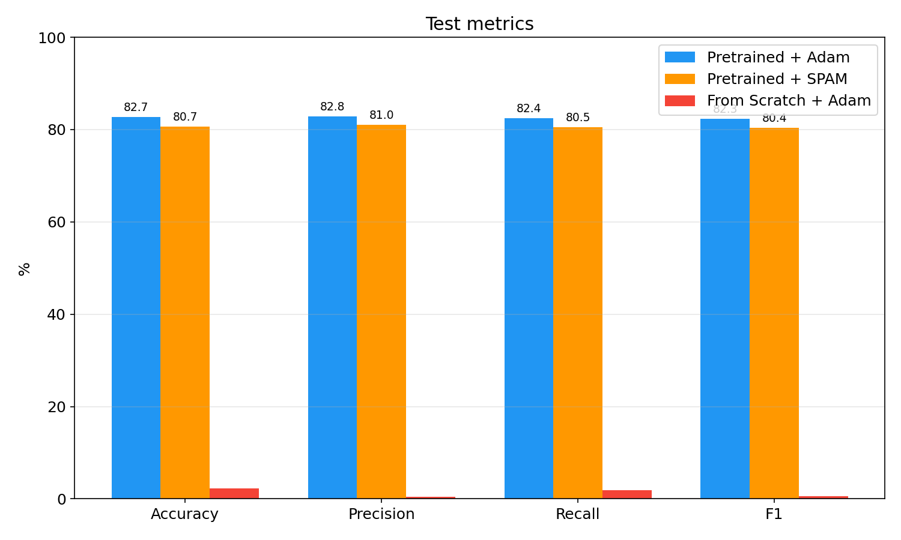
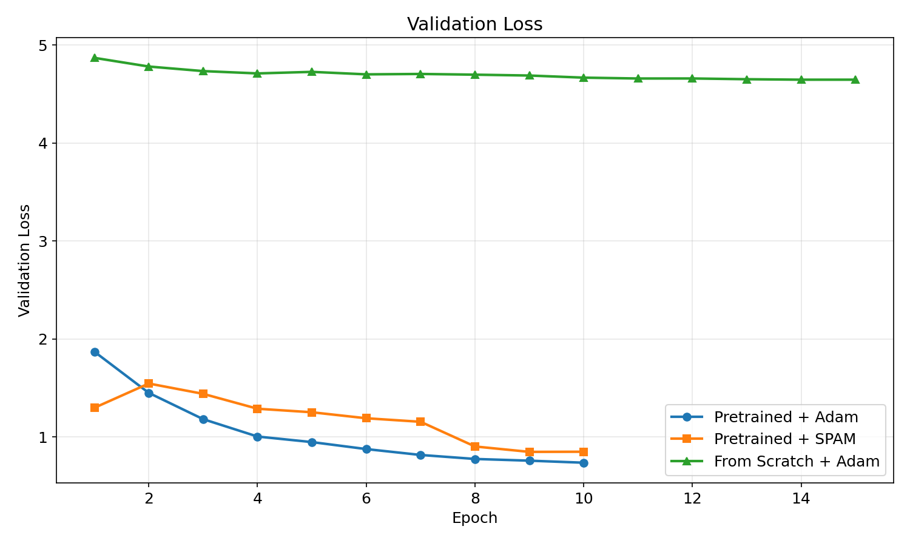
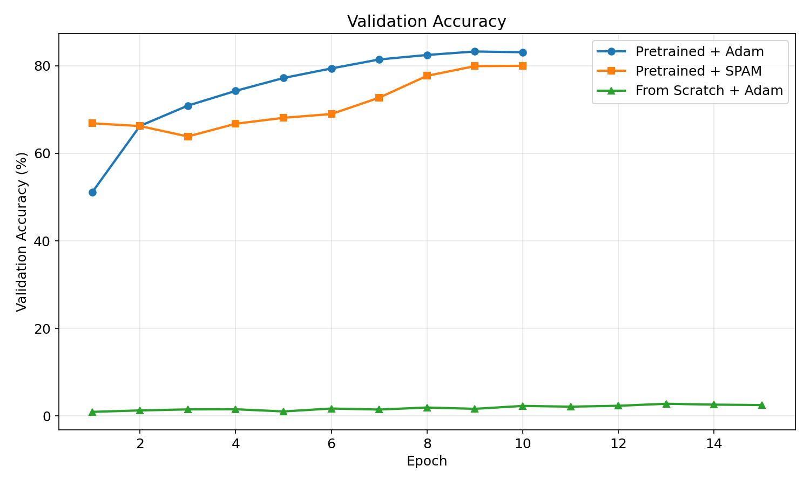
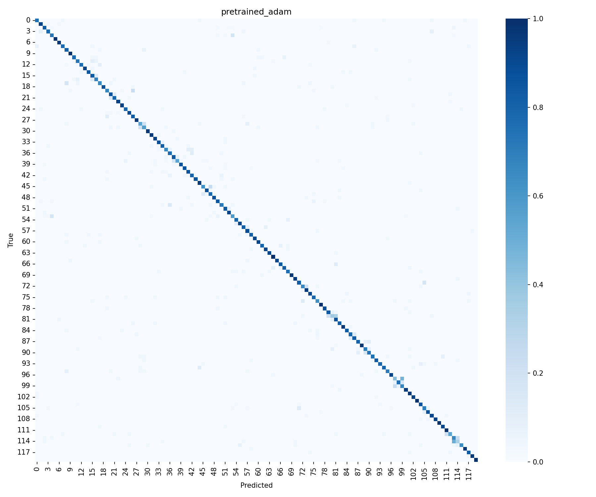
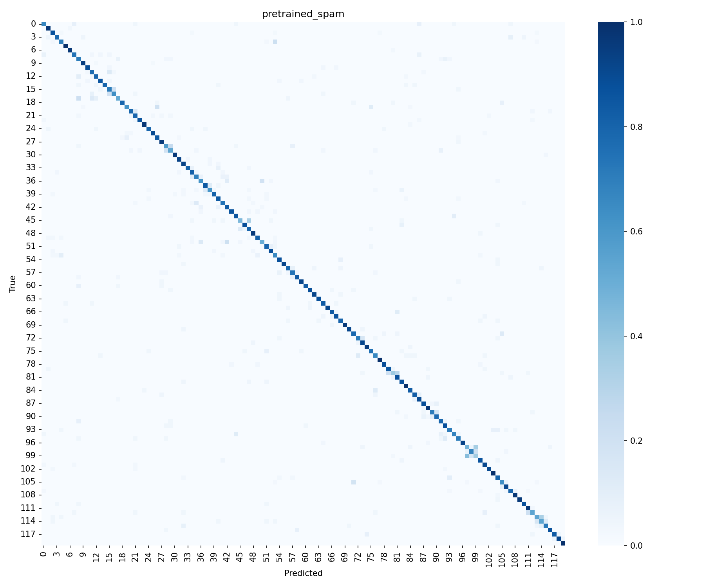
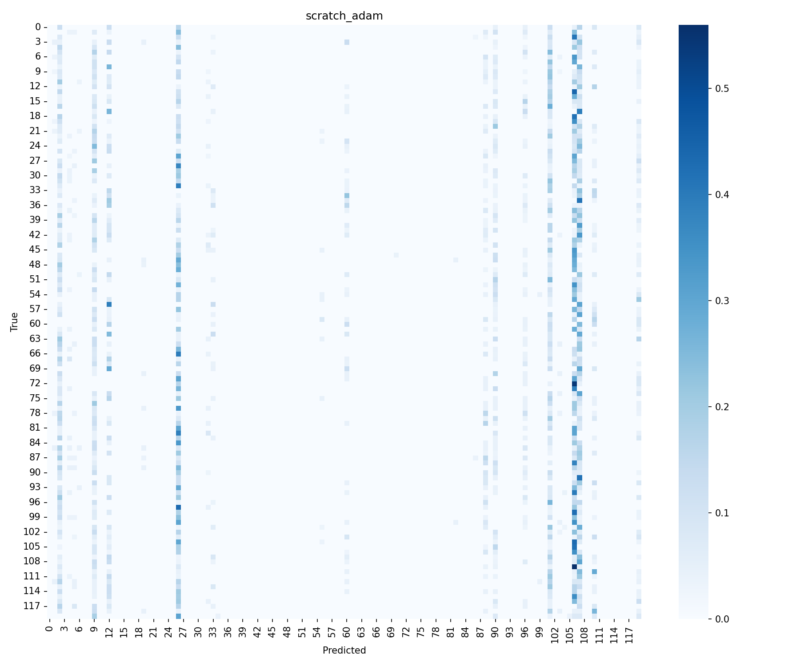

# Лабораторная работа №1 -- Классификация пород собак с помощью Vision Transformer

**Выполнили студенты группы 459м** Лягушин Федор (Boomrock) и Возиянов Лев (leoeich34)

Использовался датасет Stanford Dogs, архитектура ViT-B/16 и фреймворк PyTorch + timm

## Ход работы

Мы обучили нейросеть распознавать породу собаки по фотографии. Для этого был задействован датасет с 120 породами и примерно 20 тысяч изображений. По варианту использовалась архитектура Vision Transformer, в которой изображение нарезается на патчи 16x16 и обрабатывается как последовательность, по аналогии с токенами в языковых моделях.
Первым экспериментом был fine-tuning предобученного ViT с Adam, затем состоялся fine-tuning с SPAM-оптимизатором и дополнительно провели обучение ViT с нуля как случайную инициализацию с применением Adam.

## Теория
### Vision Transformer (ViT)
ViT работает не так, как обычные сверточные сети. Вместо сверток изображение нарезается на фиксированные патчи, а в нашем случае он был размером 16x16 пикселей, и каждый патч линейно проецируется в вектор, где дальше последовательность этих векторов обрабатывается стандартным Transformer-энкодером с механизмом self-attention.

У ViT-B/16 мы сделали набор параметров из 12 слоев, 12 голов внимания, размерность 768 и MLP-размерность 3072. Входное изображение 224x224 разбивается на 196 патчей с 14x14 сеткой. К ним добавляется cls-токен, по которому строится классификация. Как выяснилось далее, для ViT нужно много данных, поэтому на маленьких датасетах обучить его с нуля практически нереально, потому что у Transformer нет тех индуктивных предпосылок, которые есть у сверточных сетей, а именно локальность итрансляционная инвариантность. Без предобучения на ImageNet модель не может выучить полезные признаки за разумное время. В нашем случае 10 эпох на Adam'e заняло более 1.5 часов. 

### Transfer learning

Здесь мы берем модель, уже обученную на ImageNet и дообучаем на нашей задаче. Затем заменяем последний слой, classification head, на новый с 120 выходами. Предобученные веса уже содержат хорошие визуальные признаки, например текстуры, формы, цвета - и нам остается только адаптировать их под породы собак.

### Оптимизаторы

Согласно лабораторной работе, мы провели обучение с использованием двух оптимизаторов, Adam и SPAM.
AdamW есть стандарт для обучения трансформеров, у которого есть адаптивные моменты первого и второго порядка вместе с раздельным затуханием весов. Здесь параметры следующие: lr=1e-4, weight_decay=0.05.
SPAM - это модификация Adam, которая использует знак градиента для обновления и периодически сбрасывает накопленный момент. Идея оптимизатора в том, что сброс моментов помогает уйти из плоских участков loss-ландшафта и делает обучение более стабильным в шумных условиях. Параметры подобраны как и у Adam - lr=1e-4 и weight_decay=0.05, а также добавлен density=0.6.

### MixUp аугментация

Во время обучения используем MixUp с alpha=0.8 - это случайная линейная комбинация двух изображений и их меток. Оно работает как регуляризатор и заставляет модель учить более гладкие решающие границы. При MixUp используется SoftTargetCrossEntropy вместо обычной кросс-энтропии.

## Структура проекта

```
mainlab/
├── configs/
│   ├── pretrained_adam.yaml
│   ├── pretrained_spam.yaml
│   └── scratch_adam.yaml
├── src/
│   ├── dataset.py
│   ├── model.py
│   ├── train.py
│   ├── evaluate.py
│   ├── optimizer.py
│   └── utils.py
├── spam/
│   └── spam.py
├── results/
│   ├── pretrained_adam/
│   ├── pretrained_spam/
│   ├── scratch_adam/
│   └── experiment_results.xlsx
└── notebooks/
```

## Разбиение данных

Датасет разбит на три части со стратификацией (каждая порода представлена пропорционально):

| Часть | Доля | Изображений |
|-------|------|-------------|
| Train | 70%  | ~14 406     |
| Val   | 15%  | ~3 087      |
| Test  | 15%  | 3 200       |

Seed традиционно зафиксирован на 42, разбиение воспроизводимо.

## Результаты

### Тестовые метрики

| Эксперимент | Accuracy | Precision | Recall | F1-score | Эпох |
|-------------|----------|-----------|--------|----------|------|
| **Pretrained + Adam** | **82.66%** | **82.81%** | **82.44%** | **82.32%** | 10 |
| Pretrained + SPAM | 80.66% | 80.98% | 80.49% | 80.39% | 10 |
| From Scratch + Adam | 2.22% | 0.44% | 1.89% | 0.60% | 15 |

Pretrained + Adam показал лучшие результаты по всем метрикам, а SPAM отстает на пару процентных пунктов. Обучение с нуля за 15 эпох по сути не обучилось, у него accuracy на уровне случайного угадывания, т.е 1/120.



### Adam vs SPAM

При одинаковых условиях, где был предоставлен предобученный ViT, 10 эпох и одинаковые параметры, Adam также обошел SPAM:

| Метрика | Adam | SPAM | Разница |
|---------|------|------|---------|
| Accuracy | 82.66% | 80.66% | +2.00% |
| Precision | 82.81% | 80.98% | +1.83% |
| Recall | 82.44% | 80.49% | +1.95% |
| F1 | 82.32% | 80.39% | +1.93% |

Разница небольшая. Промежуточный вывод таков: SPAM мог бы догнать базовую Adam при более тщательном подборе гиперпараметров, но в наших условиях Adam работает стабильнее.

### Сходимость

Adam сходится быстрее, ведь уже на 3-й эпохе val accuracy ~71%, а к 10-й 83%. SPAM стартует медленнее, и если сравнивать первую эпоху, то val acc оказался 67% против 51% у Adam, а к десятой зафиксировался на 80%.

При обучении с нуля val accuracy колебалась в районе 1-3% все 15 эпох. Loss снижался медленно, но модель так и не начала осмысленно различать породы.





Здесь мы приходим к очередному выводу, что обучение с нуля на 120 классов достаточно сложная задача и результат неэффективен. У ViT нет сверточных индуктивных предпосылок, и ему нужно выучить вообще все из данных, от детекции краев до высокоуровневых паттернов. На около 14 тысячах тренировочных изображений это не получается за 15 эпох и вряд ли получится за 100 без дополнительных кастомизаций модели вроде заморозки слоев, более агрессивной аугментации и так далее.

Для сравнения: оригинальный ViT обучался на JFT-300M (300 миллионов изображений). Наш датасет в 20 000 раз меньше.

### Матрицы ошибок

Pretrained + Adam:



Pretrained + SPAM:



From Scratch + Adam:



## Воспроизведение

Обучение проводилось на Kaggle (GPU T4/P100). Для повторения:

```bash
pip install -r requirements.txt

python -m src.train --config configs/pretrained_adam.yaml
python -m src.train --config configs/pretrained_spam.yaml
python -m src.train --config configs/scratch_adam.yaml

python -m src.evaluate --config configs/pretrained_adam.yaml
```

## Выводы

Pretrained ViT с Adam выдал 82.66% accuracy на 120 классах за 10 эпох что является хорошим результатом для датасета такого размера. Наш вариант со SPAM отстал на 2%, но с подбором гиперпараметров мог бы подтянуться к метрикам базы. Также стоит отметить, что обучение с нуля на 14 тысячах картинок не имеет смысла для такой архитектуры, так как ей нужны миллионы примеров, чтобы выучить базовые визуальные признаки без предобученных весов.

## Список источников

1. Dosovitskiy, A. et al. "An Image is Worth 16x16 Words: Transformers for Image Recognition at Scale."arXiv:2010.11929, 2021.
2. Tianjin H., Ziquan Z., Gaojie J., Lu L., Zhangyang W., Shiwei L. "SPAM: Spike-Aware Adam with Momentum Reset for Stable LLM Training." arXiv:2501.06842, 2025.
3. Zhang, H. et al. "mixup: Beyond Empirical Risk Minimization." arXiv:1710.09412, 2018.
4. Loshchilov, I. & Hutter, F. "Decoupled Weight Decay Regularization." arXiv:1711.05101, 2019.
5. Stanford Dogs Dataset -- http://vision.stanford.edu/aditya86/ImageNetDogs/
6. timm (PyTorch Image Models) -- https://github.com/huggingface/pytorch-image-models
