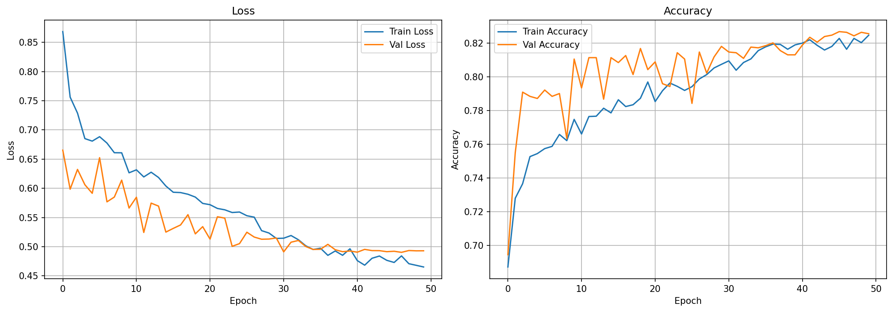
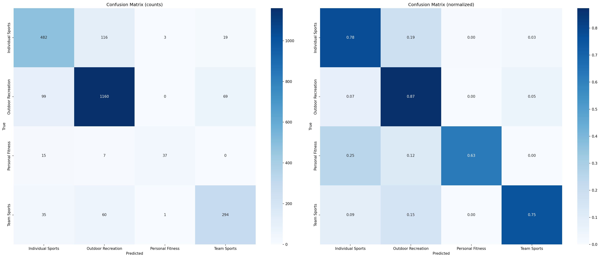
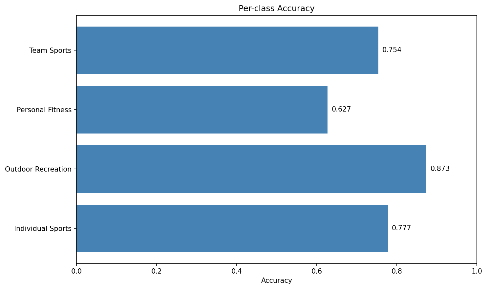

# Лабораторная работа №2 — Классификация видео по субтитрам с помощью Transformer

**Выполнили студенты группы 459м** Лягушин Федор (Boomrock) и Возиянов Лев (leoeich34)

Использовался датасет HowTo100M (категория Sports), предобученная модель `all-MiniLM-L6-v2` для эмбеддингов и кастомный Transformer-классификатор на PyTorch.

## Ход работы

Мы обучили нейросеть классифицировать видео по подкатегориям спорта (Sports) на основе текстовых субтитров. В отличие от первой лабы, где классифицировались изображения собак, здесь мы работаем с текстовыми последовательностями (чанками субтитров).

Этапы работы:
1. **Подготовка данных**: Загрузка метаданных HowTo100M, фильтрация категории "Sports", загрузка и обработка субтитров (ASR).
2. **Извлечение признаков**: Преобразование текстовых чанков в эмбеддинги с помощью `all-MiniLM-L6-v2` (384-мерные векторы).
3. **Обучение**: Обучение классификатора на базе TransformerEncoder с нуля. Использовались AdamW и CosineAnnealingLR.
4. **Оценка**: Расчет метрик на тестовом наборе, анализ ошибок и матрица ошибок.

## Теория

### HowTo100M и обработка текста
HowTo100M — это огромный датасет с видеоинструкциями. Каждое видео снабжено субтитрами (ASR-транскрибациями).
Текст каждого видео разбивается на чанки (последовательности слов), которые затем преобразуются в эмбеддинги.

### Sentence Transformers
Для получения эмбеддингов используется модель `all-MiniLM-L6-v2`. Она компактна и эффективна, выдавая вектор размерности 384 для любого текстового входа. Это позволяет представить видео как последовательность векторов (один вектор на чанк).

### Transformer Classifier
На вход подается последовательность эмбеддингов размера `(batch, seq_len, 384)`.
Архитектура включает:
- **PositionalEncoding**: добавление информации о позиции чанка в последовательности.
- **TransformerEncoder**: 2 слоя, 4 головы внимания, размерность 384, MLP-размерность 256.
- **Classifier**: LayerNorm -> Linear -> GELU -> Dropout -> Linear (выход на 4 класса).

### Борьба с дисбалансом классов
В данных присутствует сильный дисбаланс (например, "Outdoor Recreation" — 8853 видео, а "Personal Fitness" — 397).
Используется взвешивание классов по формуле `sqrt(max_count / count)`, что помогает модели лучше обучаться на редких классах.

## Структура проекта

```
mainlab/
├── configs/
│   └── config.yaml
├── data/                         # Данные (не в репозитории, .gitignore)
│   ├── train.parquet
│   ├── val.parquet
│   ├── test.parquet
│   ├── embeddings.npz
│   └── sports_captions.jsonl
├── notebooks/
│   ├── 01_data_preparation.ipynb
│   ├── 02_embedding_extraction.ipynb
│   ├── 03_train_and_evaluate.ipynb
│   └── convert_to_jsonl.ipynb
├── outputs/
│   ├── best_model.pt
│   ├── results.json
│   ├── training_history.png
│   ├── confusion_matrix.png
│   └── per_class_accuracy.png
├── src/
│   ├── dataset.py          # Класс датасета для эмбеддингов
│   ├── model.py            # TransformerClassifier
│   ├── utils.py            # Метрики, визуализация
│   ├── embeddings.py       # Логика извлечения эмбеддингов
│   ├── preprocessing.py    # Фильтрация, чанкование, EDA
│   └── validation.py       # Проверка целостности данных
└── README.md
```

## Разбиение данных

Датасет разбит на три части со стратификацией (каждая подкатегория представлена пропорционально):

| Часть | Доля | Изображений |
|-------|------|-------------|
| Train | 70%  | 11 183      |
| Val   | 15%  | 2 396       |
| Test  | 15%  | 2 397       |

Классы (подкатегории Sports):
1. **Individual Sports** (4 131 видео)
2. **Outdoor Recreation** (8 853 видео)
3. **Personal Fitness** (397 видео)
4. **Team Sports** (2 595 видео)

## Результаты

### Тестовые метрики

| Метрика | Значение |
|---------|----------|
| **Accuracy** | **81.69%** |
| **Macro F1** | **76.92%** |
| Weighted F1 | 81.72% |
| Precision (Macro) | 79.01% |
| Recall (Macro) | 75.40% |
| Top-3 Accuracy | 99.21% |

### Отчет по классам (Classification Report)

| Класс | Precision | Recall | F1-score | Support |
|-------|-----------|--------|----------|---------|
| Individual Sports | 0.76 | 0.78 | 0.77 | 620 |
| Outdoor Recreation | 0.88 | 0.86 | 0.87 | 1328 |
| Personal Fitness | 0.80 | 0.63 | 0.70 | 59 |
| Team Sports | 0.72 | 0.74 | 0.73 | 390 |
| **Macro avg** | **0.79** | **0.75** | **0.77** | **2397** |
| **Weighted avg** | **0.82** | **0.82** | **0.82** | **2397** |

Лучший результат (Macro F1: 77.06%) был достигнут на 26-й эпохе.

### Анализ ошибок

Наиболее частые ошибки классификации:
1. **Outdoor Recreation → Individual Sports** (105 случаев) — природные активности путаются с индивидуальными видами спорта.
2. **Individual Sports → Outdoor Recreation** (97 случаев).
3. **Outdoor Recreation → Team Sports** (74 случая).

Класс **Personal Fitness** (самый малочисленный, 397 образцов) имеет самый низкий Recall (0.63), что говорит о трудности его выделения на фоне других.

### Графики обучения



### Матрица ошибок



### Точность по классам



## Воспроизведение

Обучение проводилось на Kaggle (GPU T4/P100). Для повторения:

```bash
pip install -r requirements.txt

# 1. Подготовка данных (скачивает HowTo100M metadata и captions)
jupyter notebook notebooks/01_data_preparation.ipynb

# 2. Извлечение эмбеддингов (требует скачанных данных)
jupyter notebook notebooks/02_embedding_extraction.ipynb

# 3. Обучение и оценка
jupyter notebook notebooks/03_train_and_evaluate.ipynb
```

## Выводы

Transformer-классификатор, обученный на текстовых эмбеддингах субтитров, показал accuracy **81.69%** и macro F1 **76.92%**.
Использование предобученных моделей для эмбеддингов (`all-MiniLM-L6-v2`) позволило эффективно работать с текстом без необходимости обучать тяжелые языковые модели с нуля.

Основная проблема — сильный дисбаланс классов. Класс "Outdoor Recreation" доминирует, а "Personal Fitness" представлен слабо, что приводит к просадке метрик на миноритарных классах. Взвешивание `sqrt_inverse_frequency` помогло частично решить эту проблему, подняв Recall малых классов.

Top-3 Accuracy составляет **99.21%**, что означает: модель практически всегда включает верный ответ в топ-3 предсказаний, что полезно для реальных рекомендательных систем.

## Список источников

1. Miech, A. et al. "HowTo100M: Learning a Text-Video Embedding by Watching Hundred Million Narrated Video Clips." ICCV 2019.
2. Reimers, N. & Gurevych, I. "Sentence-BERT: Sentence Embeddings using Siamese BERT-Networks." arXiv:1908.10084, 2019.
3. Vaswani, A. et al. "Attention is All You Need." NeurIPS 2017.
4. HowTo100M Dataset -- https://www.rocq.inria.fr/cluster-willow/amiech/howto100m/
5. Sentence Transformers -- https://www.sbert.net/
